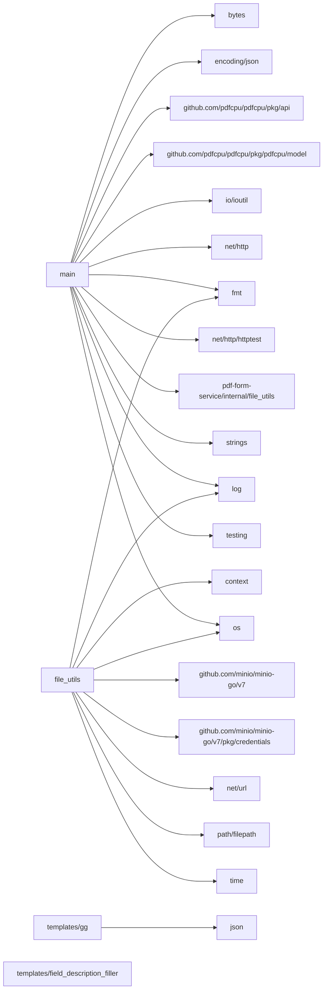

# LLM Project Summarizer
[](https://github.com/MuhammadYossry/llm-project-summarizer/actions/workflows/ci.yml)
[](https://badge.fury.io/py/llm-project-summarizer)
[](https://pypi.org/project/llm-project-summarizer)
[](https://opensource.org/licenses/MIT)

LLM Project Summarizer is a specialized command-line tool that transforms Python and Go codebases into concise, structured summaries optimized for Large Language Models. When working with LLMs like ChatGPT or Claude, sending entire codebases is often impractical due to context limitations. This tool solves that problem by generating intelligent summaries that capture the essential architecture, relationships, and patterns in your code while excluding implementation details.

The tool understands language-specific patterns – in Go, it recognizes packages, interfaces, and implementations; in Python, it comprehends modules, class hierarchies, and type annotations. The output is formatted in Markdown with Mermaid diagrams, making it ideal for LLM consumption and human readability.

## Table of Contents
- [Features](#features)
- [Installation](#installation)
- [Usage](#usage)
- [Configuration](#configuration)
- [How It Works](#how-it-works)
- [Examples](#examples)
- [Contributing](#contributing)
- [Testing](#testing)
- [License](#license)

## Features

✨ **Smart Code Analysis**
- Understands Python and Go code patterns
- Extracts classes, functions, interfaces and their relationships
- Identifies key architectural patterns

📊 **Rich Visualization**
- Generates Mermaid diagrams showing dependency relationships
- Creates hierarchical package/module summaries
- Shows inheritance and implementation relationships

🔧 **Flexible Configuration**
- Exclude patterns and directories
- Customize output format and detail level
- YAML configuration support


## Installation

### Option 1: Install from PyPI
```bash
pip install llm-project-summarizer
```

### Option 2: Install from GitHub
```bash
pip install git+https://github.com/MuhammadYossry/llm-project-summarizer.git
```

### Option 3: Development Installation
```bash
# Clone the repository
git clone https://github.com/MuhammadYossry/llm-project-summarizer
cd llm-project-summarizer

# Install with poetry (recommended for development)
poetry install

# Or install with pip in editable mode
pip install -e .
```


## Usage

### Basic Usage
```bash
# Using pip installed version
llm-project-summarizer /path/to/project

# Custom output file
llm-project-summarizer /path/to/project -o custom_summary.md

# Exclude patterns
llm-project-summarizer /path/to/project --exclude "vendor/*" --exclude "*.test.go"
```

### Using Poetry
```bash
# Install and run using poetry
poetry install
poetry run llm-project-summarizer/path/to/project

# Run with options
poetry run llm-project-summarizer /path/to/project -o summary.md --exclude "vendor/*"
```

### With Configuration File
Create `.summarizer.yaml`:
```yaml
exclude:
  - "vendor/*"
  - "**/*_test.go"
  - "**/__pycache__"
output: "project_summary.md"
```

Use the config:
```bash
llm-project-summarizer /path/to/project --config .summarizer.yaml
```

### Command Line Options
```bash
llm-project-summarizer--help

Options:
  --output, -o PATH    Output file path [default: project_summary.md]
  --exclude, -e TEXT   Exclusion patterns (can be used multiple times)
  --config, -c PATH    Path to config file
  --help              Show this message and exit
```
## How It Works

The tool employs language-specific parsers to analyze source code. For Go, it uses pattern matching to identify packages, interfaces, and implementations. For Python, it utilizes the Abstract Syntax Tree (AST) to extract classes, functions, and their relationships. The parsed information is then organized into a hierarchical structure optimized for LLM understanding.

## Examples
for example running the tool against this Python project project
`llm-project-summarizer llm-project-summarizer -o summary.md`
will output into `summary.md`
```
# Project Summary

## Project Architecture
This is a project with the following structure:

### Package Structure

#### __init__.py

#### cli.py

Symbols:

  function: def load_config(config_path)
    Load configuration from YAML file

  function: @...
@...
@...
@...
@...
def main(project_path, output, exclude, config)
    Analyze and summarize a code project for LLM consumption.

#### parsers/base.py

Symbols:

  class: @dataclass
class CodeSymbol
    Represents a code symbol (function, class, interface, etc.)

  class: @dataclass
class FileSymbols
    Contains all symbols found in a single file

  class: class LanguageParser(ABC)
    Abstract base class for language-specific parsers

  function: def _sanitize_docstring(self, docstring)
    Cleans up a docstring for consistent formatting

  function: @abstractmethod
def can_parse(self, filename)
    Determines if this parser can handle the given file

  function: @abstractmethod
def parse_file(self, filepath)
    Parses a file and returns its symbols

#### parsers/go.py

Symbols:

  class: class GoParser(LanguageParser)
    Parses Go source files to extract symbols and relationships

  function: def _extract_docstring(self, content, start_pos)
    Extract Go-style documentation comments

  function: def _extract_functions(self, content)
    Extract function declarations from Go source

  function: def _extract_imports(self, content)
    Extract all imports from Go source

  function: def _extract_interfaces(self, content)
    Extract interface declarations from Go source

  function: def _extract_package(self, content)
    Extract the package name from Go source

  function: def _extract_types(self, content)
    Extract type declarations from Go source

  function: def can_parse(self, filename)

  function: def parse_file(self, filepath)

#### parsers/python.py

Symbols:

  class: class PythonParser(LanguageParser)
    Parses Python source files using the ast module

  function: def _extract_imports(self, tree)
    Extract all imports from an AST

  function: def _format_arguments(self, args)
    Format function arguments as a string

  function: def _format_decorators(self, decorators)
    Format decorators as strings

  function: def _format_expression(self, node)
    Format an AST expression node as a string

  function: def _process_async_function(self, node)
    Process an async function definition

  function: def _process_class(self, node)
    Process a class definition

  function: def _process_function(self, node)
    Process a function definition

  function: def can_parse(self, filename)

  function: def parse_file(self, filepath)

#### summarizer.py

Symbols:

  class: class ProjectSummarizer
    Main class for summarizing a project's structure

  function: def __init__(self)

  function: def _extract_dependencies(self, results)
    Extract nodes and edges for the dependency graph.
Returns:
    - List of (node_id, display_name) tuples
    - Set of (from_node, to_node) edges

  function: def _generate_mermaid_graph(self, results)
    Generate a properly formatted Mermaid dependency graph.

  function: def _get_package_display_name(self, filepath, file_symbols)
    Get a human-readable package name for display

  function: def _sanitize_node_id(self, name)
    Convert package name to valid Mermaid node ID.
Removes special characters and ensures valid Mermaid ID format.

  function: def summarize_project(self, project_path, exclusions)
    Summarize all supported files in the project

  function: def write_summary(self, project_path, results, output_file)
    Write the project summary to a file
```
And the mermaid dependices graph

```mermaid
graph LR;
    %% Nodes
    llm_project_summarizer___init__["llm_project_summarizer/__init__"];
    llm_project_summarizer_cli["llm_project_summarizer/cli"];
    llm_project_summarizer_summarizer["llm_project_summarizer/summarizer"];
    parsers_python["parsers/python"];
    parsers_go["parsers/go"];
    parsers_base["parsers/base"];
    click["click"];
    logging["logging"];
    yaml["yaml"];
    pathlib_Path["pathlib.Path"];
    typing_Optional["typing.Optional"];
    summarizer_ProjectSummarizer["summarizer.ProjectSummarizer"];
    os["os"];
    re["re"];
    typing_Dict["typing.Dict"];
    typing_List["typing.List"];
    typing_Set["typing.Set"];
    typing_Tuple["typing.Tuple"];
    parsers_base_FileSymbols["parsers.base.FileSymbols"];
    parsers_go_GoParser["parsers.go.GoParser"];
    parsers_python_PythonParser["parsers.python.PythonParser"];
    ast["ast"];
    typing_Any["typing.Any"];
    base_LanguageParser["base.LanguageParser"];
    base_FileSymbols["base.FileSymbols"];
    base_CodeSymbol["base.CodeSymbol"];
    typing_Match["typing.Match"];
    abc_ABC["abc.ABC"];
    abc_abstractmethod["abc.abstractmethod"];
    dataclasses_dataclass["dataclasses.dataclass"];
    dataclasses_field["dataclasses.field"];
    %% Dependencies
    llm_project_summarizer_cli --> click;
    llm_project_summarizer_cli --> logging;
    llm_project_summarizer_cli --> pathlib_Path;
    llm_project_summarizer_cli --> summarizer_ProjectSummarizer;
    llm_project_summarizer_cli --> typing_Optional;
    llm_project_summarizer_cli --> yaml;
    llm_project_summarizer_summarizer --> logging;
    llm_project_summarizer_summarizer --> os;
    llm_project_summarizer_summarizer --> parsers_base_FileSymbols;
    llm_project_summarizer_summarizer --> parsers_go_GoParser;
    llm_project_summarizer_summarizer --> parsers_python_PythonParser;
    llm_project_summarizer_summarizer --> re;
    llm_project_summarizer_summarizer --> typing_Dict;
    llm_project_summarizer_summarizer --> typing_List;
    llm_project_summarizer_summarizer --> typing_Optional;
    llm_project_summarizer_summarizer --> typing_Set;
    llm_project_summarizer_summarizer --> typing_Tuple;
    parsers_base --> abc_ABC;
    parsers_base --> abc_abstractmethod;
    parsers_base --> dataclasses_dataclass;
    parsers_base --> dataclasses_field;
    parsers_base --> typing_List;
    parsers_base --> typing_Optional;
    parsers_base --> typing_Set;
    parsers_go --> base_CodeSymbol;
    parsers_go --> base_FileSymbols;
    parsers_go --> base_LanguageParser;
    parsers_go --> re;
    parsers_go --> typing_List;
    parsers_go --> typing_Match;
    parsers_go --> typing_Optional;
    parsers_python --> ast;
    parsers_python --> base_CodeSymbol;
    parsers_python --> base_FileSymbols;
    parsers_python --> base_LanguageParser;
    parsers_python --> logging;
    parsers_python --> typing_Any;
    parsers_python --> typing_List;
    parsers_python --> typing_Optional;
    parsers_python --> typing_Set;
```

Running it against a Go project
`llm-project-summarizer pdf-form-service -o summary.md`
will result into output
```
# Project Summary

## Project Architecture
This is a Go project with the following structure:

### Package Structure

#### internal/file_utils/file_utils.go
Package: file_utils

Symbols:

  function: func CreateFile(filePath string) (*os.File, error)
    createFile creates a file at the given path and returns a file pointer.

  function: func GenerateUniqueFileName(baseName string)
    generateUniqueFileName generates a unique filename for the output file.

  function: func OpenFile(filePath string) (*os.File, error)
    openFile opens the file at the given path and returns a file pointer.

#### internal/file_utils/minio_utils.go
Package: file_utils

Symbols:

  function: func InitAndTestMinio()

  function: func UploadFileToBucket(filePath string)

  function: func getEnv(key, fallback string)
    Utils

#### main.go
Package: main

Symbols:

  type: type ExportFormResponse struct
    ExportFormResponse represents the response body for the export-form endpoint.

  type: type FillFormRequest struct
    FillFormRequest represents the request body for the fill-form endpoint.

  type: type FillFormResponse struct
    FillFormResponse represents the response body for the fill-form endpoint.

  function: func exportFormHandler(w http.ResponseWriter, r *http.Request)
    exportFormHandler handles the Get request to the /export-form endpoint.

  function: func fillFormHandler(w http.ResponseWriter, r *http.Request)
    fillFormHandler handles the POST request to the /fill-form endpoint.

  function: func main()

  function: func validateFileName(fileName string) (string, error)
    validateFileName checks if the given filename is allowed.

#### main_test.go
Package: main

Symbols:

  function: func TestFillFormHandler(t *testing.T)
    TestFillFormHandler tests the fillFormHandler endpoint.
```
With the mermaid dependices graph



## Contributing

We welcome contributions. To get started:

1. Fork the repository
2. Create a feature branch
3. Make your changes
4. Add tests for any new functionality
5. Submit a pull request

## Testing

Run the test suite using Poetry:

```bash
# Run all tests
poetry run pytest

# Run tests with coverage report
poetry run pytest --cov=llm_project_summarizer tests/ --cov-report=term-missing

# Run specific test files
poetry run pytest tests/test_parsers.py
```

## License

This project is licensed under the MIT License
